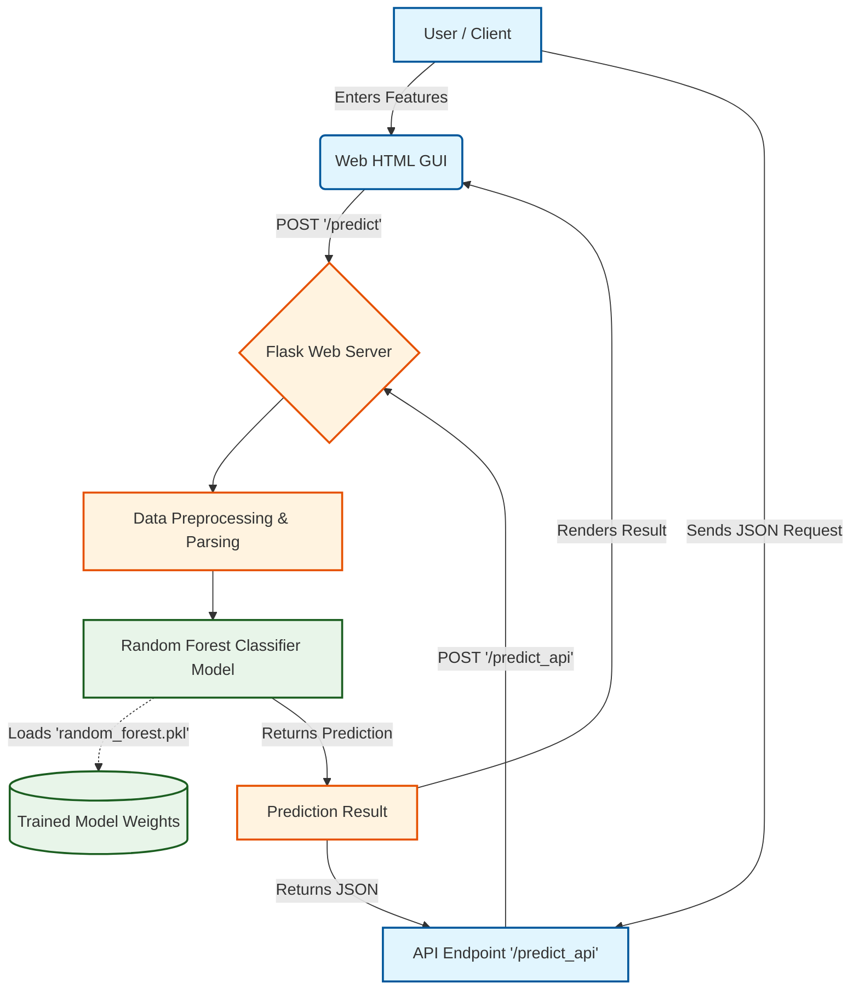

# Cardiac Arrhythmia Detection System

## 📌 Project Overview
Cardiac Arrhythmia Detection System is an end-to-end Machine Learning web application that predicts the type of cardiac arrhythmia based on patient ECG features. It utilizes a trained Random Forest Classifier to process input features and classify the cardiac condition efficiently. 

The application is built using Flask and provides both a web-based Graphical User Interface (GUI) and a REST API for direct programmatic predictions.

---

## 🚀 Features
- **Machine Learning Model:** Utilizes a highly accurate Random Forest model (`random_forest.pkl`).
- **Interactive Web Interface:** A user-friendly HTML GUI to input patient features and receive immediate predictions.
- **RESTful API Endpoint:** Allows developers to send JSON requests and receive predictions programmatically.
- **Data Exploration:** Includes comprehensive Jupyter Notebooks for Exploratory Data Analysis (EDA) and model training logic.

---

## 🏗️ System Architecture Flowchart



---

## 📂 Project Structure

```text
Cardiac-Arrhythmia-Type-Detection/
│
├── app.py                 # Main Flask application file
├── model/                 # Directory containing the saved ML model
│   └── random_forest.pkl  # Trained Random Forest model
├── Notebooks/             # Directory containing Jupyter notebooks
│   ├── final_eda.ipynb    # Final Exploratory Data Analysis
│   ├── mini-project.ipynb # Model training and experiments
│   └── ...
├── static/                # Static files (CSS, JS, Images)
└── templates/             # HTML templates for the web GUI (e.g., index.html)
```

---

## 🛠️ Tech Stack
- **Backend:** Python, Flask
- **Machine Learning:** Scikit-Learn, NumPy, Pandas
- **Serialization:** Pickle
- **Frontend:** HTML, CSS

---

## 💻 Installation & Usage

### 1. Clone the repository
```bash
git clone https://github.com/yourusername/Cardiac-Arrhythmia-Type-Detection.git
cd Cardiac-Arrhythmia-Type-Detection
```

### 2. Install Dependencies
Ensure you have Python 3.x installed. Install the required libraries:
```bash
pip install Flask numpy scikit-learn pandas
```

### 3. Run the Application
Start the Flask server:
```bash
python app.py
```

The application will start on `http://127.0.0.1:5000/`.
Navigate to this URL in your browser to use the web interface.

---

## 📡 API Reference

### Predict via API
You can get predictions by sending a POST request to `/predict_api`.

**Endpoint:** `POST /predict_api`

**Example Request:**
```json
{
  "feature_1": 45.0,
  "feature_2": 1.0,
  "feature_3": 55.0,
  "feature_n": 8.5
}
```

**Example Response:**
```json
2
```
*(Returns the class index or label of the predicted Arrhythmia type)*

---

## 📓 Notebooks & EDA
The `Notebooks/` directory contains in-depth analysis and modeling:
- `final_eda.ipynb` : Detailed exploratory data analysis on the Arrhythmia dataset.
- `mini-project.ipynb` : Feature engineering, model selection, and training of the Random Forest classifier.

---

## 🤝 Contributing
Contributions are welcome! Please fork the repository and create a pull request with your changes.

1. Fork the Project
2. Create your Feature Branch (`git checkout -b feature/AmazingFeature`)
3. Commit your Changes (`git commit -m 'Add some AmazingFeature'`)
4. Push to the Branch (`git push origin feature/AmazingFeature`)
5. Open a Pull Request
